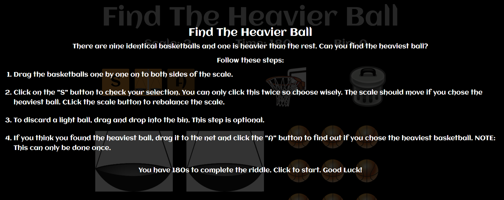
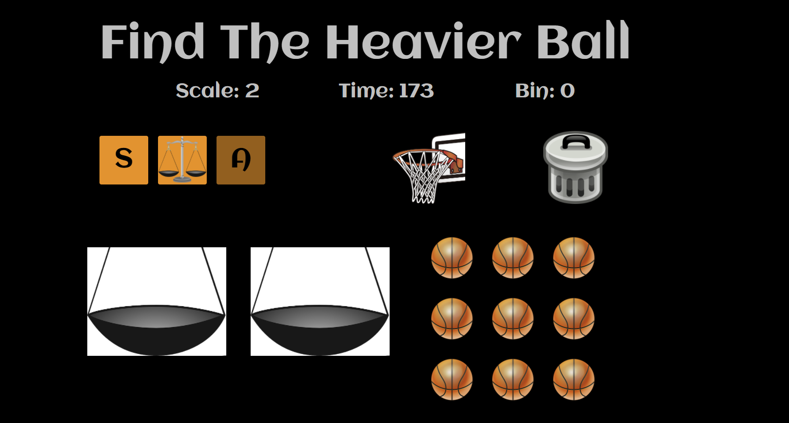
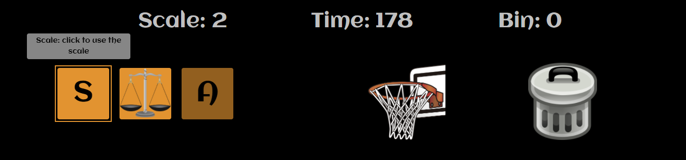
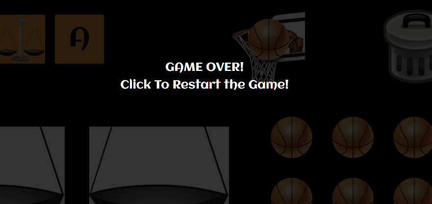
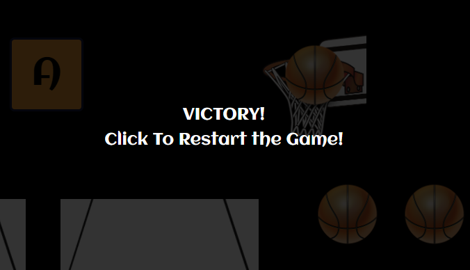
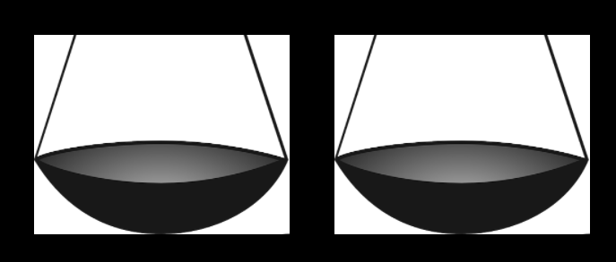
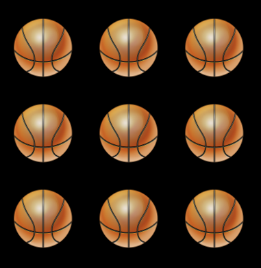

# Find The Heavier Ball

Mile Stone Two: Interactive Front-End Development - Code Institute.
This project is used for educational purposes only for a school coding project.
There will be no commercial use of this code or project. It is inspired by a math riddle that I resolved when I was a kid.

# Demo 
A live demo for this project can be found [here](https://ig30.github.io/Game-MS2/). This project is hosted on GitHub pages.

# Technologies

1. HTML5
2. CSS3
3. JavaScript
4. JQuery
5. Bootstrap

# UX 

The purpose of this project is to create an iteractive and aesthetically pleasing math riddle.

Client Stories:

1. As a user I would like to be presented with all the elemets needed to resolve the riddle so I don't need to use anything external to the page.
2. As a user I would like all the element to be presented with a cohesive desing style.
3. As a user I would like time to trickle down from say 180 seconds instead of it starting at 00:00 and be infinite to make the game more challenging.
4. As a user I would like to have a count of the balls that I have discarded to quickly assess my progress.
5. As a user I would like a way to quickly restart the game.

# Features

**In order to achieve the above fun and aesthetically pleasing riddle I did the follow**

* When the game is launched a screen pops up with a message. The player is told the rules of the game, the time and click to start.

* Once the user click to start they will see the main page. In this page there diffetent features. The title, the control panel, the sides of the scale and the group of basketballs.

**The tilte**

If the users click on the titlte the game will restart. This is indicated in the rules and on a tooltip that user will see when Hover on the title.

**Control Panel**

It contains the following elemets:

1. Scale: Indicates the amount of move left with the scale.
2. Time: Indicates the time left to complete the riddle.
3. Bin: Indicates the amount of balls in the bin.
4. S button: Calls the function to check for the hevier ball inside the sides of the scale. If it is in it the scale will move.
5. Scale icon button: It is use to rebalance the scale.
6. A button: Calls the fuction to check the users answer.
7. Basket: The user will drag the answer here to activate the A button and check it.
8. Bin icon: The user can user it to discard the balls that are not the heaviest.

Apart fron the first, second and third element, the rest have a tooltip with a small description. The tooltip is activated when hovering on the element.

* When the time runs out or the user give an incorrect answer a game over message will be display. And if the user gives a correct answer a victory message will be display.

**Sides of the Scale**

The user can drag the balls here to use the scale to check for the heavier ball. If the Heavier ball is in the selection of balls that user chose the scale will move.

**Group of balls**

The group of basketballs are draggable and they can be place on the scale, the bin and the basket net.

# Manual Testing

1. Scenario
* **Given** The project page
* **When** the user open the page
* **Then** The first overlay appears from the center of the page growing foward
* **And** the user is able to read the rules of the riddle.

2. Scenario
* **Given** the first overlay
* **When** the user click to start the game
* **Then** the main page is visible
* **And** the time countdown is started

3. Scenario
* **Given** the main page
* **When** the user hover over the title
* **And** after click on it
* **Then** the game is restarted. 

4. Scenario
* **Given** the main page
* **When** the user hover on the "S Button" or "The scale icon" or "A button" or "Basket net" or "the bin icon"
* **Then** A tooltip is display with a small description

5. Scenario
* **Given** the main page
* **When** the user click and hold on a ball
* **Then** the user is able to drop the ball on to the "side of the scale" or the "basket net" or "the bin"

6. Scenario
* **Given** the main page
* **When** the user drag the heavy basketball on to the "left side" or the "right side" of the scale
* **And** click the S button
* **Then** the side with the heavy ball drop down
* **And** the sacle count drop down one

7. Scenario
* **Given** the main page
* **When** the "left side" or "right side" of the scale is down
* **And** the user clicks the "scale icon"
* **Then** the sides of the scale rebalance.

8. Scenario
* **Given** the main page
* **When** the user drag a ball into the basket net
* **Then** the "A button" gets enable

9. Scenario
* **Given** the main page
* **When** the user drag multiple balls into the basket net
* **Then** the "A button" remains disabled

10. Scenario
* **Given** the main page
* **When** there is a light ball in the basket net
* **And** the user click on the "A button"
* **Then** the "game over" overlay is display from the center growing foward.

11. Scenario
* **Given** the main page
* **When** there is the heavier ball in the basket net
* **And** the user click on the "A button"
* **Then** the "victory" overlay is display from the center growing foward.

12. Scenario
* **Given** the "game over" or "Victory overlay
* **When** the user clicks on the page
* **Then** the riddle restart

13. Scenario
* **Given** the main page
* **When**the user drag a ball into the bin
* **Then** the bin count up by one

Testing the game help me find out that when the user restarted the game after clicking on the title or the game over and victory overlay the time was going twice as fast.
This was happening because of the way that the script.js was written. The event listeners and the time count down were call multiple times. This meant that after restarting the game
the time was going twice as fast. One time for the first round and another time for the second round. So everytime that the user click to restart the time was going fater and faster.
Same with the eventListeners, everytime that user restarted the game the S button was already disable because for the riddle the button was already used twice.
To resolve this issue I put all the eventListener into the one fuction to make sure that they were called correctly. For the buttons clicks counts I set their values 
into variable that will get reset everytime the game restart.

